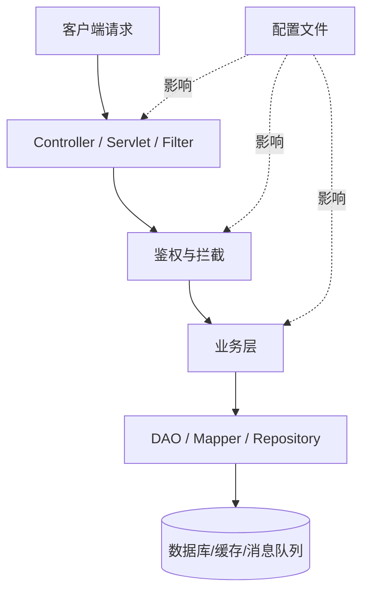

# Java Web 审计初始分析

先建立“结构认知”，再进入漏洞点分析。目标是用最短路径回答四件事：项目怎么组织、用了什么技术、请求从哪里进入、整体结构如何表达。

## 执行要求

1. 优先用 `rg --files`、`rg`、`find`、`ls` 识别目录与关键文件，不先做细节漏洞推断。
2. 先判断项目类型，再判断框架，再定位入口点，不要跳步。
3. 输出必须面向后续审计，避免只做“开发视角”的项目介绍。
4. 图示优先使用 `mermaid`，节点命名保持简洁，能反映请求流向与模块边界。

## 分析顺序

### 1. 判断项目形态

优先识别以下文件或目录：

- `pom.xml`、`build.gradle`、`settings.gradle`
- `src/main/java`、`src/main/resources`、`src/test/java`
- `WEB-INF`、`web.xml`、`jsp/`、`templates/`、`static/`
- `application.yml`、`application.yaml`、`application.properties`
- `bootstrap.yml`、`logback.xml`、`log4j*.xml`

判断结果至少要说明：

- 是单体 Web、Spring Boot、传统 Servlet/JSP，还是多模块 Maven/Gradle 项目
- 是否存在管理端、API 端、前后台分离、网关、定时任务、消息消费等附加边界
- 是否存在独立公共模块、基础设施模块、业务模块

### 1.1 多模块 Maven 项目专项分析

如果存在父 `pom.xml` 与多个 `module`，按以下顺序处理：

1. 先识别聚合父项目与继承父项目是否为同一个 `pom`。
2. 提取所有 `<modules>`，建立“模块名 -> 相对路径 -> 模块职责”对应关系。
3. 区分以下常见模块类型：

- 启动模块：包含 `main` 方法、`@SpringBootApplication`、打包为可运行 jar/war
- Web 模块：包含 `controller`、`servlet`、`filter`、页面模板、`web.xml`
- 业务模块：包含 `service`、领域逻辑、流程编排
- 数据模块：包含 `mapper`、`repository`、`entity`、SQL 映射
- 公共模块：包含 `common`、`utils`、`base`、`core`、`api` 等复用代码
- 集成模块：包含 `client`、`feign`、`dubbo`、`mq`、`job`、`gateway` 等外部交互逻辑

4. 明确依赖方向，至少说明“哪个模块暴露入口、哪个模块承载业务、哪个模块落库或访问外部系统”。
5. 如果模块之间通过接口、RPC、事件、MQ 解耦，要单独指出跨模块调用链。
6. 如果多个模块都包含 Web 入口，要区分管理端、开放端、内部端、测试端。

多模块项目的结构图优先画“模块关系图”，再画核心请求链，不要一开始就下钻到单个包级别。

### 2. 识别技术栈

至少覆盖以下维度：

- Web 框架：Spring MVC、Spring Boot、Struts2、Servlet/JSP 等
- ORM/持久层：MyBatis、Hibernate、JPA、JdbcTemplate 等
- 安全组件：Shiro、Spring Security、JWT、自定义鉴权
- 中间件痕迹：Redis、MQ、ElasticSearch、Nacos、Dubbo、Feign 等
- 模板与视图：JSP、Thymeleaf、Freemarker
- 构建与运行：Maven/Gradle、Tomcat/Jetty/内嵌容器

识别时同时记录版本线索，例如：

- `pom.xml` 依赖版本
- `parent`、`dependencyManagement`
- Banner、启动日志、配置注释中的版本信息

### 3. 定位入口点

按“外部输入能到哪里”进行归纳，至少检查：

- Web 入口：`web.xml`、`DispatcherServlet`、`ServletContainerInitializer`
- Spring Boot 入口：`@SpringBootApplication`、`main` 方法、自动配置类
- MVC 入口：`@Controller`、`@RestController`、`@RequestMapping`
- 过滤与拦截：`Filter`、`HandlerInterceptor`、AOP 切面
- 生命周期入口：`ServletContextListener`、`ApplicationRunner`、`CommandLineRunner`
- 任务入口：`@Scheduled`、Quartz Job
- 消息入口：MQ Consumer、Listener、消息回调
- RPC 入口：Dubbo Provider、Feign 暴露接口、自定义远程服务入口

入口点输出不要只列类名，要说明：

- 文件路径
- 注解或配置依据
- 大致请求流向
- 与鉴权、参数绑定、模板渲染、文件操作、反序列化等风险面的关系

### 4. 绘制项目结构图

图示最少包含：

- 顶层模块
- Web 请求入口
- 核心业务层
- DAO / Repository 层
- 配置与资源目录
- 外部依赖或中间件

优先输出 `mermaid` 示例结构：



## 输出格式

最终输出按以下顺序组织：

### 1. 项目概览

- 项目类型
- 模块划分
- 运行方式

### 2. 技术栈

按“框架 / 持久层 / 安全组件 / 中间件 / 视图层 / 构建方式”分组列出。

### 3. 入口点

按“HTTP 入口、过滤链、生命周期、任务、消息、RPC”分类列出，写明路径与依据。

### 4. 项目结构图

给出一份简洁、可读的 `mermaid` 图。

### 5. 初始审计建议

只给最关键的 3 到 5 个优先审计方向，例如：

- 鉴权与访问控制链
- 参数绑定与反序列化入口
- 文件上传下载与路径处理
- 模板渲染与表达式执行
- SQL 构造与 ORM 映射边界

## 常见 Java Web 入口点速查输出模板

需要快速汇总入口点时，直接使用以下模板：

```markdown
### 入口点速查

#### 1. HTTP 入口
| 类型 | 位置 | 依据 | 说明 |
| --- | --- | --- | --- |
| Controller | `src/main/java/.../UserController.java` | `@RestController` `@RequestMapping("/user")` | 对外 API 入口 |
| Servlet | `src/main/java/.../DownloadServlet.java` | 继承 `HttpServlet` / `web.xml` 注册 | 原生 Servlet 入口 |

#### 2. 过滤与拦截
| 类型 | 位置 | 依据 | 说明 |
| --- | --- | --- | --- |
| Filter | `src/main/java/.../AuthFilter.java` | 实现 `Filter` / `FilterRegistrationBean` | 鉴权、包装请求、输入预处理 |
| Interceptor | `src/main/java/.../LoginInterceptor.java` | 实现 `HandlerInterceptor` | 请求前后置处理 |

#### 3. 生命周期与启动
| 类型 | 位置 | 依据 | 说明 |
| --- | --- | --- | --- |
| Boot Main | `src/main/java/.../Application.java` | `@SpringBootApplication` + `main` | 应用启动入口 |
| Runner | `src/main/java/.../InitRunner.java` | `CommandLineRunner` | 启动后执行初始化逻辑 |
| Listener | `src/main/java/.../StartupListener.java` | `ServletContextListener` | 容器生命周期入口 |

#### 4. 异步与任务
| 类型 | 位置 | 依据 | 说明 |
| --- | --- | --- | --- |
| Scheduled | `src/main/java/.../CleanJob.java` | `@Scheduled` | 定时任务入口 |
| Quartz | `src/main/java/.../SyncQuartzJob.java` | 实现 `Job` | 调度任务入口 |
| MQ Listener | `src/main/java/.../OrderConsumer.java` | `@RabbitListener` / `@KafkaListener` | 消息消费入口 |

#### 5. RPC / 远程暴露
| 类型 | 位置 | 依据 | 说明 |
| --- | --- | --- | --- |
| Dubbo Provider | `src/main/java/.../UserRpcServiceImpl.java` | `@DubboService` | RPC 服务暴露入口 |
| Feign Client | `src/main/java/.../RemoteUserClient.java` | `@FeignClient` | 对外部服务调用点 |
```

如发现高风险入口，在表格后补一行“审计关注点”，直接标注参数绑定、文件处理、模板渲染、反序列化、表达式求值或鉴权缺失等风险。

## 注意事项

1. 证据不足时，明确标注“推测”或“待确认”。
2. 不要把所有类机械罗列出来，优先提炼结构与边界。
3. 如果项目是多模块，先讲模块关系，再讲模块内部入口。
4. 如果发现安全组件或网关层，要单独指出其在请求链中的位置。
